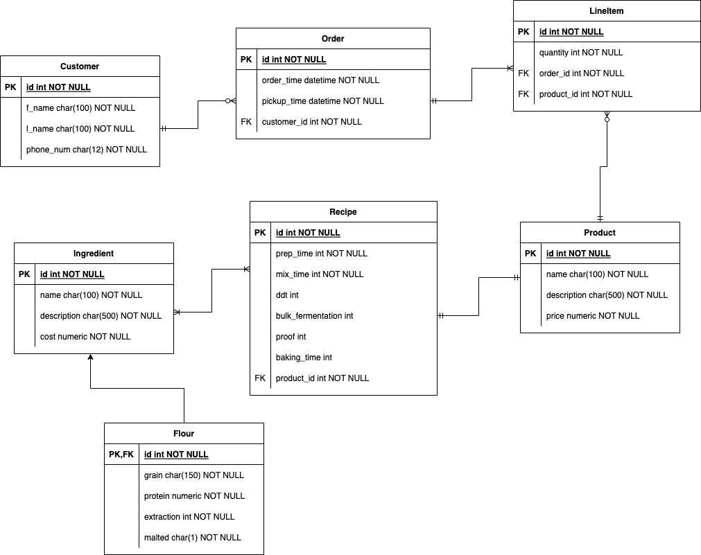

# Microbakery Managment Software (WIP)

## Panaderia
Panaderia (name subject to change) is a full stack web application created with React and Spring Boot for a small batch 
baker to manage their small business. The user is able to perform CRUD operations on PostgreSQL tables such as Customer, Order, 
Product, and etc through the UI. Spring Boot acts as a REST api and exposes endpoints to the React app so the user can
modify and read data from the database. Both the frontend and backend are bundled together as one executable JAR file using Maven which is then 
deployed to Heroku.

## Objective
The main reason I built this was for my own learning. I want to completely understand and build both the frontend and 
backend for a full stack web project. I also wanted to learn the Spring Framework and Spring Boot, learn more advanced React
concepts, develop a greater understanding for relational databases and creating a schema, and improve my coding skills in 
both TypeScript and Java.

## Schema

Gonna do a lot of this over at some point, and add tables for Addresses, Supplier, etc.

## Technologies

### Frontend:
 - TypeScript
 - React
    - ChakraUI v2.1.2 for UI components
    - React Router DOM v6.3.0 for client side routing
    - Fetch API and React Query v3.39.1 for consuming endpoints
    - Framer Motion v6.3.6 as a dependency for ChakraUI (and to hopefully eventually add my own custom animatons)

### Backend:
 - Java 18
 - Spring Boot Web
 - Spring Boot Data JPA
 - Hibernate
 - PostgreSQL
 - Heroku

## Installation 
To run locally you can either run the frontend and bakcend separately using `npm start` and `command for maven i forgot`. (make sure you run `npm install` )

Or you can simply build a JAR file using `mvn install clean` which will bundle the file in the directory `target`.
Then run `java -jar microbakery-0.0.1-SNAPSHOT.jar` to run it.

## Todo
- Finish adding/updating records through client
- Expand on current schema, add new relations and tables
- Recipe builder
- ***Add unit and integration tests for both fronend and backend!***

## Future Plans
- Add log in system and user authentication with Spring Security
- Add dashboard pages with graphs based on table data
- Add more pages beyond basic crud tables
